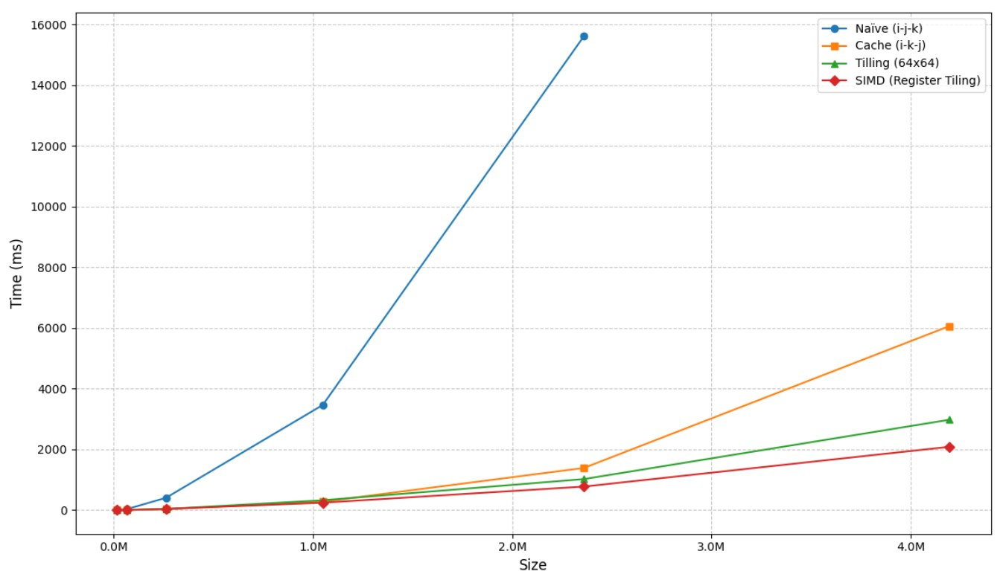
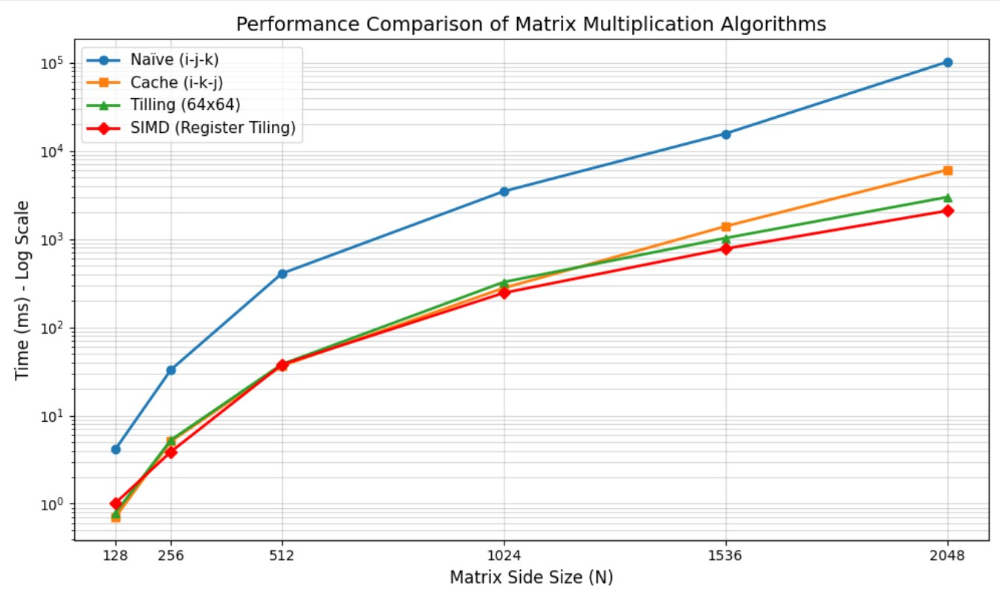

# Attention Layer and MatMul Optimization

В проекте реализована функция внимания с разными методами матричного умножения

$$
\text{Attention}(Q, K, V) = \text{softmax}\left(\frac{QK^T}{\sqrt{d_k}}\right)V
$$

Где:
* Q (Queries) — тензор размером [batch_size, seq_lenq, dk]
* K (Keys) — тензор размером [batch_size, seq_lenk, dk]
* V (Values) — тензор размером [batch_size, seq_lenk, dv]
* dk — размерность ключей/запросов
* dv — размерность значений
Выход: тензор размером [batch_size, seq_lenq, dv]

## 1. Методы умножения матриц

### Naive MatMul
*   Классическая реализация «строка на столбец» с тремя вложенными циклами в порядке $i \rightarrow j \rightarrow k$.
*   Низкая производительность на больших данных из-за неэффективного использования кэша. При переборе индекса $k$ во второй матрице происходит постоянный «прыжок» по столбцам, что приводит к кеш промахам.

### Cache-Optimized MatMul (i-k-j)
*   Перестановка порядка циклов на $i \rightarrow k \rightarrow j$.
*   В самом внутреннем цикле мы обращаемся к элементам матриц подряд, двигаясь вдоль строки. Происходит ускорение благодаря пространственной локальности, так как процессор за один проход читает целую кэш-линию и использует все данные в ней.

### Tiling MatMul 
*   Разбиение матриц на блоки (тайлы) размером $T \times T$.
*   Ускорение благодаря временной локальности. Мы многократно переиспользуем данные блока, прежде чем они будут вытеснены из кэша следующими данными.

### SIMD MatMul
*   Использование векторных инструкций для обработки 8 чисел `float` за один такт. Также используем tiling, но теперь вычисляем все пачками данных, используем 14 векторных регистров для вычисления.
  <details>
<summary> Code</summary>

```bash
...
for (size_t i0 = 0; i0 < rows1; i0 += tiling_size) {                  //
            for (size_t j0 = 0; j0 < cols2; j0 += tiling_size) {      // tiling
                for (size_t k0 = 0; k0 < cols1; k0 += tiling_size) {  //
                ...
                    size_t i = i0;
                    for (; i + 1 < i_max; i += 2) {
                    ...
                        size_t j = j0;
                        for (; j + 31 < j_max; j += 32) {
                        ...
                            __m256 c00 = _mm256_setzero_ps(), c01 = _mm256_setzero_ps();
                            __m256 c02 = _mm256_setzero_ps(), c03 = _mm256_setzero_ps();
                            __m256 c10 = _mm256_setzero_ps(), c11 = _mm256_setzero_ps();
                            __m256 c12 = _mm256_setzero_ps(), c13 = _mm256_setzero_ps(); //reserve reg_rectors for ans

                            for (size_t k = k0; k < k_max; ++k) {
                                __m256 a0 = _mm256_set1_ps(mat1[i][k]);
                                __m256 a1 = _mm256_set1_ps(mat1[i + 1][k]); //copy elements from mat1

                                const float* b_ptr = &mat2[k][j];
                                __m256 b0 = _mm256_loadu_ps(b_ptr);
                                __m256 b1 = _mm256_loadu_ps(b_ptr + 8);
                                __m256 b2 = _mm256_loadu_ps(b_ptr + 16);
                                __m256 b3 = _mm256_loadu_ps(b_ptr + 24); //store elements from mat2

                                c00 = _mm256_fmadd_ps(a0, b0, c00);
                                ...
                                c13 = _mm256_fmadd_ps(a1, b3, c13); // c = c + a*b
                            }

                            _mm256_storeu_ps(c_ptr0 + j,      _mm256_add_ps(_mm256_loadu_ps(c_ptr0 + j), c00));
                            ...
                            _mm256_storeu_ps(c_ptr1 + j + 24, _mm256_add_ps(_mm256_loadu_ps(c_ptr1 + j + 24), c13)); //after full processing store to ans
                        }

                        for (; j < j_max; ++j) {
                        //processing tail for j
                        }
                    }

                    for (; i < i_max; ++i) { // processing tail for i
                        float* c_ptr = &ans[i][0];
                        for (size_t j = j0; j < j_max; ++j) {
                            float sum = 0;
                            for (size_t k = k0; k < k_max; ++k) {
                                sum += mat1[i][k] * mat2[k][j];
                            }
                            c_ptr[j] += sum;
                        }
                    }
                }
            }
        }
```
</details> 

## 2. Анализ производительности
Измерено время выполнения Attention с помощью разных видов матричного умножения:
### Таблица измерений

|Кол-во элементов выходной матриццы| Naive (i-j-k) | Cache (i-k-j) | Tilling (64x64) | SIMD|
| :--- | :--- | :--- | :--- | :--- |
| 16,384 | 4.14 | 0.70 | 0.78 | 1.01 |
| 65,536 | 32.97 | 5.09 | 5.27 | 3.88 |
| 262,144 | 405.88 | 36.35 | 38.01 | 37.66 |
| 1,048,576 | 3,462.58 | 277.79 | 324.59 | 244.51 |
| 2,359,296 | 15,612.10 | 1,389.21 | 1,022.65 | 775.65 |
| 4,194,304 | 101,453.00 | 6,064.05 | 2,978.06 | 2,086.61 |

Время указано в миллисекундах (мс).

### Графики производительности




## 3. FlashAttention (Online Softmax)

### Идея и реализация
Основная проблема стандартного Attention — мы **выделяем отдельно в памяти** матрицу внимания($Q$* $K_t$) и работаем с ней, применяем softmax и умножаем на тензор $Values$.

**FlashAttention** реализовано экономнее:

Мы не создаем матрицу $Scores$(матрица $Q$* $K_t$ в обычном attention) размером $seq_q * seq_k$, мы создаем маленькие буферы размером tiling_size.
Так как мы идем тайлами по матрицам $Q$ и $K_t$ мы не высчитываем до конца для матрицы внимания и не можем найти сумму элементов всец строки и применить софтмакс, но мы все равно применяем его, используя каждый раз корректировку **(Online Softmax)**: 

На каждом новом тайле вычисляется локальный максимум $m_{block}$, который сравнивается с глобальным максимумом $m_{old}$, полученным на предыдущих этапах. В случае, если новый максимум превышает старый, ранее вычисленные значения становятся математически неверными, так как их масштаб был привязан к старому значению. Для исправления этой ситуации накопленная сумма знаменателя $d$ и вектор ответа $O$ домножаются на коэффициент коррекции $e^{m_{old} - m_{new}}$. После корректировки вычисляются экспоненты для элементов текущего тайла относительно нового максимума $m_{new}$, которые затем прибавляются к общей сумме $d$, а взвешенные значения из тайла $V$ добавляются к вектору ответа $O$. Итоговый результат формируется только после обработки всех тайлов ключей $K$ для текущего запроса $Q$ однократным делением накопленного вектора $O$ на финальную сумму экспонент $d$.

  <details>
<summary> Code</summary>

```bash
        ...
        std::vector<float> S_block(tiling_size * tilling_size, 0.0f); //for Q*K_t
        std::vector<float> O_block(tiling_size * dv, 0.0f); //for S_block*V
        std::vector<float> m_val(tiling_size, -INFINITY);
        std::vector<float> d_val(tiling_size, 0.0f);
        ...
        for (size_t b = 0; b < batch_size; ++b) {
        ...
            for (size_t i0 = 0; i0 < seq_q; i0 += tiling_size) { //tiling
            ...

                //Q*scale
                for (size_t i = 0; i < block_q_len; ++i) {
                ...
                    for (size_t k = 0; k < dk; ++k) {
                        q_s_row[k] = q_row[k] * scale;
                    }
                }

                //create S_block
                for (size_t j0 = 0; j0 < seq_k; j0 += tiling_size) {
                ...
                    for (size_t i = 0; i < block_q_len; ++i) {
                        const float* q_row = &Q_scaled[i * dk];
                        float*  s_row = &S_block[i * block_k_len];
                        for (size_t k = 0; k < dk; ++k) {
                            float r = q_row[k];
                            const float* kt_row = &k_T[k][j0];
                            for (size_t j = 0; j < block_k_len; ++j) {
                                s_row[j] += r * kt_row[j];
                            }
                        }
                    }

                    //softmax
                    for (size_t i = 0; i < block_q_len; ++i) {
                        float*  s_row = &S_block[i * block_k_len];
                        float*  o_row = &O_block[i * dv];
                        //find max
                        float m_block = -INFINITY;
                        for (size_t j = 0; j < block_k_len; ++j) {
                            if (s_row[j] > m_block) m_block = s_row[j];
                        }
                        ...
                        //update d
                        for (size_t j = 0; j < block_k_len; ++j) {
                            s_row[j] = std::exp(s_row[j] - m_new);
                            d_block += s_row[j];
                        }

                        m_val[i] = m_new;
                        d_val[i] = d_val[i] * exp_old + d_block;

                        for (size_t v = 0; v < dv; ++v) {
                            o_row[v] *= exp_old;
                        }

                        //create  O_block
                        for (size_t j = 0; j < block_k_len; ++j) {
                            float p = s_row[j];
                            const float* v_row = &v_mat[j0 + j][0];
                            for (size_t v = 0; v < dv; ++v) {
                                o_row[v] += p * v_row[v];
                            }
                        }
                    }
                }
                //answer = answer/d
                for (size_t i = 0; i < block_q_len; ++i) {
                    float inv_d = 1.0f / d_val[i];
                    const float* o_row = &O_block[i * dv];
                    float* out_row = &out_mat[i0 + i][0];

                    for (size_t v = 0; v < dv; ++v) {
                        out_row[v] = o_row[v] * inv_d;
                    }
                }
            }
        }
        return result;
```
</details> 

### Сравнение BasicAttention (SIMD) vs FlashAttention
Измерения проведены для тензоров с размерами B = 1 Sq = 8192 Sk = 8192 Dk = 64 Dv = 64
| Параметр | Basic Attention (SIMD) | Basic Attention (Cache)| FlashAttention|
| :--- | :--- | :--- | :--- |
| **Память** | $O(N^2)$ (материализует Scores) | $O(N^2)$ (материализует Scores) | $O(N)$ (только векторы m, d) |
| **Память** | 267 MB | 267 MB | **11 MB** |
| **Время** | 972.937 ms | 1747.49 ms | 1654.5 ms | 

### Как запустить
#### Клонируйте репозиторий Matrix_cpp (Данный проект использует модуль matrix из моего другого проекта с реализацией матриц, https://github.com/timbub/Matrix_cpp.git):
```bash
git clone ...
```
#### Клонируйте текущий репозиторий
```bash
git clone ...
cd Attention-MatMulOpt
```
#### Сборка
```bash
cmake -DCMAKE_BUILD_TYPE=Release -S . -B build
cmake --build build
```

### Запуск
```bash
# Format: ./att b|f <naive|cache|tilling|simd|flash> [tile_size]
# b - basic attention
# f - flash attention
# naive|cache|tilling|simd|flash - if you choose basic attention, choose matmul method 
./att b simd 64 < input_test.txt
```

